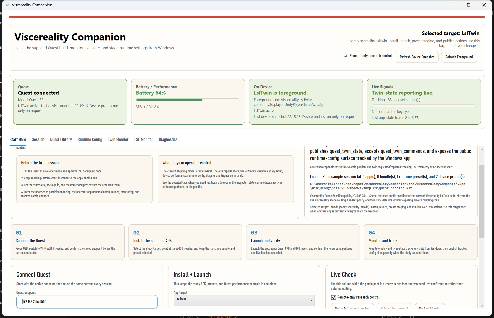
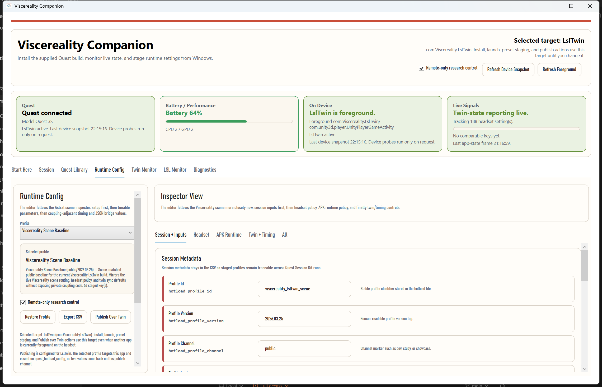
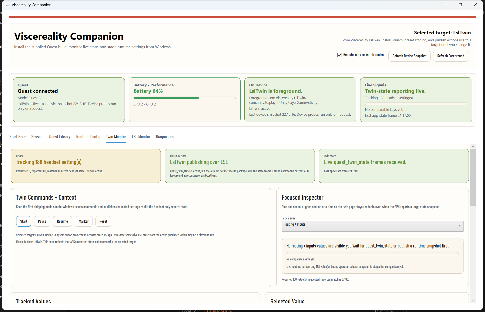

# App Overview

The desktop shell is built around the real operator workflow rather than around
repo internals.

## Start Here

The app opens with a first-session tab that keeps the common operator path in
one place:

- connect Quest
- select the supplied target
- install and launch the APK
- apply CPU and GPU levels
- confirm live monitor and twin-state status
- export a manifest at the end of the run

The same tab also exposes discovered study shells, so operators can switch from
the full app into a narrower study-specific window without installing a second
desktop application.

## Study Shells

Study shells are dedicated windows for specific protocols. They reuse the same
ADB and twin-monitor services, but they pin one APK, one device profile, and a
small set of live metrics instead of exposing the whole runtime-config and
library surface.

The first committed example is the Sussex University shell for the
controller-breathing study.

## Session

The `Session` tab keeps the full connection and device snapshot view once you
move beyond the first-session flow.

## Quest Library

This is the detailed study-build workspace:

- app targets
- bundles
- runtime presets
- device profiles
- APK overrides
- install, launch, and Quest performance controls

## Runtime Config

The runtime-config editor follows the Astral inspector structure as closely as
possible from the desktop side:

- `Session + Inputs`
- `Headset`
- `APK Runtime`
- `Twin + Timing`
- `All`

That makes it usable both as a tracking surface and as the place where desktop
operators stage or publish requested settings.

## Twin Mode

The first shipping mode is deliberately simpler than the full bidirectional
contract:

- remote-only research control stays enabled by default
- the desktop app owns trigger commands and tracked settings
- the APK reports state
- `Twin Monitor` uses a focused inspector so large live state snapshots stay readable instead of becoming one giant raw grid

## LSL Monitor

`LSL Monitor` is the quick transport check:

- stream name and type
- channel selection
- live sample value
- sample-rate and reconnect state

## Diagnostics

`Diagnostics` keeps the utility actions and the operator log without crowding
the main flow.

## Relation To The Source Repos

- `AstralKarateDojo` supplies the Quest runtime and the scene-side twin and LSL contracts.
- `AndroidPhoneQuestCompanion` supplied earlier monitor and operator-flow ideas.
- `PolarH10` informed the public Pages, onboarding, and packaging posture.
